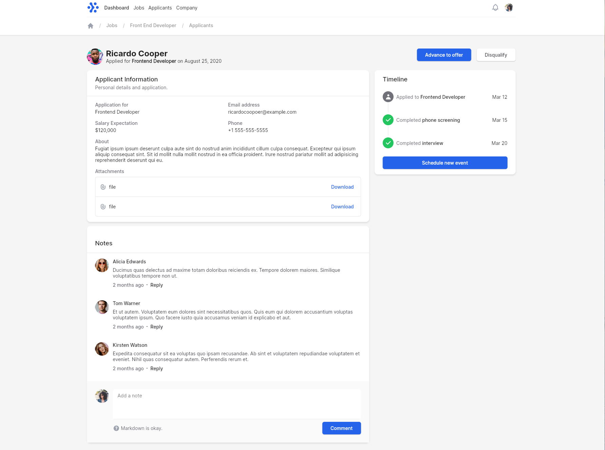
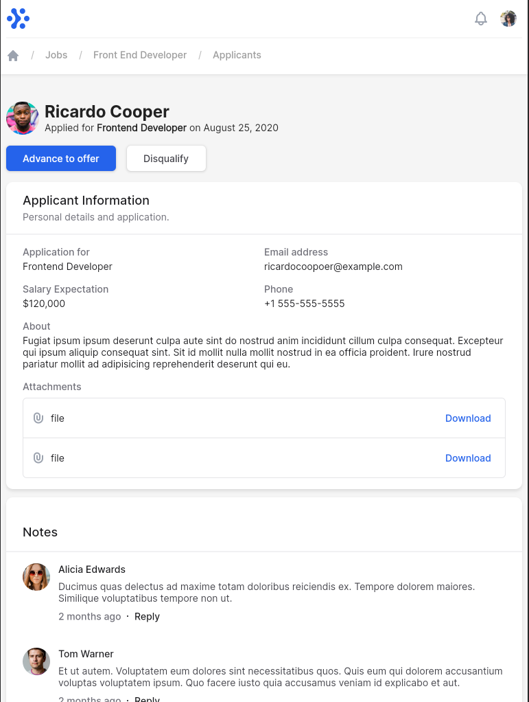
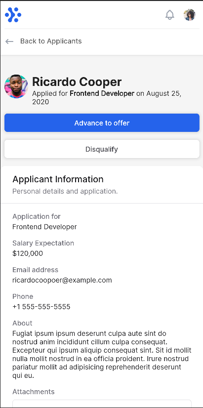

# flutter-responsive-ui

A POC implementing a screen using responsive UI with Flutter

For help getting started with Flutter, view our
[online documentation](https://flutter.dev/docs), which offers tutorials,
samples, guidance on mobile development, and a full API reference.
